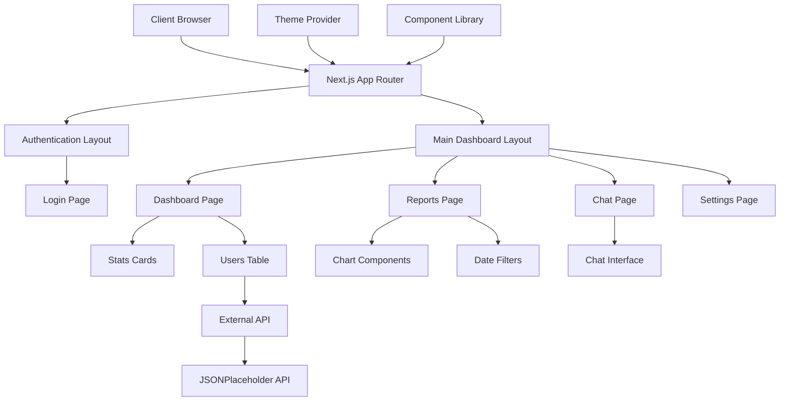

# Design Document

## Overview

The Next MUI Dashboard is a modern, responsive web application built with Next.js 15, Material UI, and Tailwind CSS. The application follows a component-driven architecture with clear separation of concerns, implementing a dashboard interface with authentication, data visualization, and interactive features. The design emphasizes accessibility, performance, and maintainability while providing a polished user experience across all device sizes.

## Architecture

### High-Level Architecture



### Technology Stack

- **Framework**: Next.js 15 with App Router and React 19
- **Styling**: Tailwind CSS 4 + Material UI v6
- **Language**: TypeScript (strict mode)
- **Charts**: Chart.js with react-chartjs-2
- **Data Fetching**: SWR for caching and state management
- **Icons**: @mui/icons-material
- **Testing**: Jest + React Testing Library
- **Linting**: ESLint + Prettier

### Folder Structure

```
app/
├── (auth)/
│   ├── login/
│   │   └── page.tsx
│   └── layout.tsx
├── (main)/
│   ├── dashboard/
│   │   └── page.tsx
│   ├── reports/
│   │   └── page.tsx
│   ├── chat/
│   │   └── page.tsx
│   ├── settings/
│   │   └── page.tsx
│   └── layout.tsx
├── globals.css
├── layout.tsx
└── page.tsx (redirects to login)

components/
├── ui/
│   ├── Card.tsx
│   ├── StatsCard.tsx
│   ├── DataTable.tsx
│   ├── SearchInput.tsx
│   ├── LoadingSkeleton.tsx
│   └── index.ts
├── layout/
│   ├── Sidebar.tsx
│   ├── Header.tsx
│   ├── Navigation.tsx
│   └── index.ts
├── charts/
│   ├── LineChart.tsx
│   ├── BarChart.tsx
│   ├── PieChart.tsx
│   ├── DateRangePicker.tsx
│   └── index.ts
├── chat/
│   ├── ChatInterface.tsx
│   ├── MessageList.tsx
│   ├── MessageInput.tsx
│   └── index.ts
└── providers/
    ├── ThemeProvider.tsx
    └── index.ts

lib/
├── api.ts
├── utils.ts
├── constants.ts
├── theme.ts
└── types.ts

hooks/
├── useUsers.ts
├── useLocalStorage.ts
├── useDebounce.ts
└── useChartData.ts

types/
├── user.ts
├── chart.ts
├── api.ts
└── index.ts
```

## Components and Interfaces

### Core Layout Components

#### Sidebar Component

```typescript
interface SidebarProps {
  isOpen: boolean;
  onClose: () => void;
  variant: "permanent" | "temporary";
}

interface NavigationItem {
  label: string;
  href: string;
  icon: React.ComponentType;
  isActive?: boolean;
}
```

**Features:**

- Responsive behavior (permanent on desktop, drawer on mobile)
- Active route highlighting
- Material UI icons integration
- Smooth animations and transitions

#### Header Component

```typescript
interface HeaderProps {
  title: string;
  user?: {
    name: string;
    avatar?: string;
  };
  onMenuClick: () => void;
}
```

**Features:**

- Welcome message display
- Mobile menu trigger
- Optional user avatar
- Responsive typography

### Data Components

#### DataTable Component

```typescript
interface DataTableProps<T> {
  data: T[];
  columns: Column<T>[];
  searchable?: boolean;
  sortable?: boolean;
  pagination?: {
    pageSize: number;
    pageSizeOptions: number[];
  };
  loading?: boolean;
  onSearch?: (query: string) => void;
  onSort?: (field: keyof T, direction: "asc" | "desc") => void;
}

interface Column<T> {
  key: keyof T;
  label: string;
  sortable?: boolean;
  render?: (value: T[keyof T], row: T) => React.ReactNode;
}
```

**Features:**

- Generic type support for any data structure
- Client-side search with debouncing (250ms)
- Column sorting with visual indicators
- Pagination with customizable page sizes
- Loading states and skeletons
- Keyboard navigation support
- Mobile-responsive design

#### StatsCard Component

```typescript
interface StatsCardProps {
  title: string;
  value: string | number;
  icon: React.ReactNode;
  trend?: {
    value: number;
    isPositive: boolean;
    period: string;
  };
  loading?: boolean;
}
```

**Features:**

- Animated count-up effects
- Trend indicators with color coding
- Loading skeleton states
- Consistent Material UI styling

### Chart Components

#### Chart Architecture

```typescript
interface ChartData {
  labels: string[];
  datasets: Dataset[];
}

interface Dataset {
  label: string;
  data: number[];
  backgroundColor?: string | string[];
  borderColor?: string;
  borderWidth?: number;
}

interface ChartProps {
  data: ChartData;
  options?: ChartOptions;
  height?: number;
  loading?: boolean;
}
```

**Chart Types:**

- LineChart: Time series data visualization
- BarChart: Categorical data comparison
- PieChart: Proportional data display

#### DateRangePicker Component

```typescript
interface DateRangePickerProps {
  startDate: Date | null;
  endDate: Date | null;
  onDateChange: (start: Date | null, end: Date | null) => void;
  maxDate?: Date;
  minDate?: Date;
}
```

### Chat Components

#### ChatInterface Component

```typescript
interface Message {
  id: string;
  content: string;
  sender: {
    id: string;
    name: string;
    avatar?: string;
  };
  timestamp: Date;
  type: "text" | "image" | "file";
}

interface ChatInterfaceProps {
  messages: Message[];
  currentUser: User;
  onSendMessage: (content: string) => void;
  loading?: boolean;
}
```

**Features:**

- Message bubble styling
- Timestamp formatting
- Sender identification
- Virtualized scrolling for performance
- Message input with Enter key support

## Data Models

### User Model

```typescript
interface User {
  id: number;
  name: string;
  username: string;
  email: string;
  phone: string;
  website: string;
  address: {
    street: string;
    suite: string;
    city: string;
    zipcode: string;
    geo: {
      lat: string;
      lng: string;
    };
  };
  company: {
    name: string;
    catchPhrase: string;
    bs: string;
  };
}
```

### Chart Data Models

```typescript
interface ChartMetrics {
  daily: ChartDataPoint[];
  weekly: ChartDataPoint[];
  monthly: ChartDataPoint[];
}

interface ChartDataPoint {
  label: string;
  value: number;
  date: Date;
}

interface DateRange {
  start: Date | null;
  end: Date | null;
}
```

### Application State

```typescript
interface AppState {
  user: {
    isAuthenticated: boolean;
    profile: User | null;
  };
  theme: {
    mode: "light" | "dark";
    primaryColor: string;
  };
  navigation: {
    sidebarOpen: boolean;
    activeRoute: string;
  };
}
```

## Error Handling

### Error Boundary Strategy

```typescript
interface ErrorBoundaryState {
  hasError: boolean;
  error: Error | null;
  errorInfo: ErrorInfo | null;
}
```

**Implementation:**

- Page-level error boundaries for route protection
- Component-level error boundaries for isolated failures
- Graceful degradation with fallback UI
- Error logging for debugging and monitoring

### API Error Handling

```typescript
interface ApiError {
  message: string;
  status: number;
  code?: string;
}

interface ApiResponse<T> {
  data?: T;
  error?: ApiError;
  loading: boolean;
}
```

**Error States:**

- Network connectivity issues
- API rate limiting
- Invalid response formats
- Timeout handling

### User Experience Error Handling

- Toast notifications for user feedback
- Retry mechanisms for failed operations
- Loading states during error recovery
- Clear error messages with actionable guidance

## Testing Strategy

### Component Testing

```typescript
// Example test structure
describe("DataTable Component", () => {
  it("renders user data correctly", () => {
    // Test data rendering
  });

  it("filters data on search input", () => {
    // Test search functionality
  });

  it("sorts data by column headers", () => {
    // Test sorting functionality
  });

  it("handles pagination correctly", () => {
    // Test pagination
  });
});
```

### Testing Approach

- **Unit Tests**: Individual component functionality
- **Integration Tests**: Component interaction and data flow
- **Accessibility Tests**: Screen reader compatibility and keyboard navigation
- **Visual Regression Tests**: UI consistency across updates

### Test Coverage Goals

- Components: 80% minimum coverage
- Utilities and hooks: 90% minimum coverage
- Critical user paths: 100% coverage

### Testing Tools

- Jest for test runner and assertions
- React Testing Library for component testing
- MSW (Mock Service Worker) for API mocking
- Axe-core for accessibility testing

## Performance Considerations

### Optimization Strategies

- **Code Splitting**: Route-based and component-based lazy loading
- **Bundle Analysis**: Regular monitoring of bundle sizes
- **Image Optimization**: Next.js Image component with WebP format
- **Caching**: SWR for data caching and revalidation

### Performance Budgets

- Initial bundle: <500KB gzipped
- Route chunks: <200KB gzipped
- Largest Contentful Paint: <2.5s
- First Input Delay: <100ms
- Cumulative Layout Shift: <0.1

### Memory Management

- Proper cleanup of event listeners
- Virtualized lists for large datasets
- Debounced search inputs
- Memoized expensive calculations

## Accessibility Implementation

### WCAG 2.1 AA Compliance

- **Color Contrast**: Minimum 4.5:1 ratio for normal text
- **Focus Management**: Visible focus indicators on all interactive elements
- **Keyboard Navigation**: Full keyboard accessibility
- **Screen Reader Support**: Proper ARIA labels and semantic HTML

### Accessibility Features

- Skip navigation links
- Descriptive alt text for images
- Form labels and error associations
- Heading hierarchy (h1-h6)
- Live regions for dynamic content updates

## Theme and Styling

### Material UI Theme Configuration

```typescript
const theme = createTheme({
  palette: {
    mode: "light", // or 'dark'
    primary: {
      main: "#1976d2",
    },
    secondary: {
      main: "#dc004e",
    },
  },
  typography: {
    fontFamily: '"Roboto", "Helvetica", "Arial", sans-serif',
  },
  components: {
    MuiButton: {
      styleOverrides: {
        root: {
          borderRadius: 8,
        },
      },
    },
  },
});
```

### Tailwind Integration

- Custom Tailwind configuration to work with MUI
- Consistent spacing scale (4, 8, 16, 24, 32px)
- Responsive breakpoints aligned with MUI
- Dark mode support with CSS variables

### Design Tokens

- Primary colors: Blue palette (#1976d2)
- Secondary colors: Pink palette (#dc004e)
- Neutral colors: Grey palette for backgrounds
- Elevation: Material Design elevation system
- Border radius: 8px for cards, 4px for buttons
- Animation duration: 150-200ms for micro-interactions
